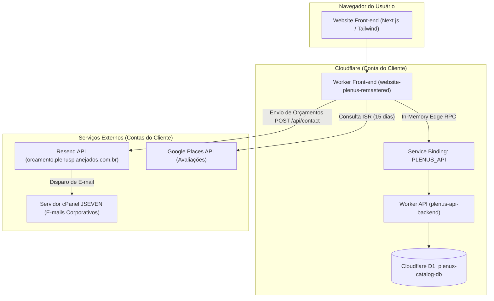

# 📋 Guia Definitivo de Migração de Infraestrutura para a Conta do Cliente
**Projeto:** Website Plenus Planejados (`plenusplanejados.com.br`)  
**Data:** 08/09/2026  
**Finalidade:** Manual passo a passo para migrar repositórios, serviços serverless, registros DNS, envios de e-mail e APIs de terceiros da conta do desenvolvedor para as contas oficiais da **Plenus Planejados**.

---

## 📌 1. Visão Geral da Migração

Atualmente, toda a infraestrutura do projeto (código-fonte, serviços de hospedagem no edge, banco de dados serverless, envios transacionais e APIs de avaliação) encontra-se provisionada em contas profissionais/pessoais do desenvolvedor. 

Este documento detalha o processo completo de **desacoplamento e transferência** para as contas proprietárias do cliente, garantindo **independência operacional**, **segurança de credenciais** e **zero downtime** para o site oficial.

### 🏢 Matriz de Serviços a Serem Transferidos

| Serviço / Plataforma | Conta Atual (Origem) | Conta Alvo (Destino) | Ativos Envolvidos |
| :--- | :--- | :--- | :--- |
| **GitHub** | Conta do Desenvolvedor | Conta / Organização GitHub Plenus | Repositórios `website-plenus-remastered` e `plenus-api-backend` |
| **Cloudflare** | Conta do Desenvolvedor | Conta Cloudflare Plenus | Zona DNS, Workers (`website-plenus-remastered`, `plenus-api-backend`), Banco D1 (`plenus-catalog-db`), Custom Domains e Service Bindings |
| **Resend** | Conta do Desenvolvedor | Conta Resend Plenus | Domínio verificado `orcamento.plenusplanejados.com.br` e `RESEND_API_KEY` |
| **Google Cloud (GCP)** | Conta do Desenvolvedor | Conta GCP / Workspace Plenus | Projeto GCP, Places API e `GOOGLE_PLACES_API_KEY` |
| **Hospedagem / DNS Origem** | JSEVEN (cPanel / Registro.br) | JSEVEN (cPanel / Registro.br) | Atualização de Nameservers autoritativos de DNS para a nova zona Cloudflare |

---

## 🏛️ 2. Arquitetura do Sistema & Pontos Chaves

Antes de iniciar as transferências, é fundamental compreender a arquitetura distribuída criada para o projeto:



### Pontos Chave da Arquitetura:
1. **Comunicação Inter-Worker sem Custo (`PLENUS_API`):** O site front-end se comunica com a API de catálogo via **Cloudflare Service Binding**. Isso significa que as chamadas ocorrem em nível de memória V8 da Cloudflare sem passar pela internet pública, eliminando latência e travamentos de CORS.
2. **Resiliência e Cache de Longa Duração (ISR):** Consultas de catálogo e avaliações do Google utilizam cache de 15 dias (`revalidate: 1296000`), garantindo custo **$0.00** de operação e velocidade instantânea de carregamento.
3. **Fail-Safe para E-mails e Avaliações:** O formulário de contato consome o Resend com validação estrita de chave e tratamento de erros. Se a API do Google oscilar, o sistema ativa um *fallback* gracioso local (`fallback-reviews.json`).

---

## 🔑 3. Inventário de Variáveis de Ambiente & Segredos

Durante a migração, **novas chaves de API devem ser geradas** nas contas do cliente. Nunca reutilize as chaves antigas do desenvolvedor.

### 3.1 Worker Front-end (`website-plenus-remastered`)

| Nome da Variável | Tipo | Onde Configurar | Descrição / Valor de Exemplo |
| :--- | :--- | :--- | :--- |
| `RESEND_API_KEY` | Plain-text / Secret | Cloudflare Workers > Settings > Variables | Chave secreta gerada na conta Resend do cliente (`re_...`) |
| `GOOGLE_PLACES_API_KEY` | Plain-text | Cloudflare Workers > Settings > Variables | Chave de API pública com restrição para Places API do GCP |
| `NEXT_PUBLIC_GOOGLE_PLACE_ID` | Plain-text | Cloudflare Workers > Settings > Variables | Place ID da empresa no Google (`ChIJ...`) |
| `INTERNAL_API_KEY` | Plain-text / Secret | Cloudflare Workers > Settings > Variables | Senha forte compartilhada entre o site e a API para rotas autenticadas |
| `PLENUS_API_URL` | Plain-text | Local / `.env.local` | URL de fallback HTTP para dev local (ex: `http://localhost:8787`) |

### 3.2 Worker API (`plenus-api-backend`)

| Nome da Variável | Tipo | Onde Configurar | Descrição / Valor de Exemplo |
| :--- | :--- | :--- | :--- |
| `API_KEY` | Secret | `wrangler secret put API_KEY` | Chave secreta interna para validação das mutações do CRUD |
| `DB` | D1 Binding | `wrangler.jsonc` / `wrangler.toml` | Vínculo nativo com o banco de dados D1 (`plenus-catalog-db`) |

---

## 🐙 4. Migração dos Repositórios no GitHub

### 4.1 Repositórios a serem Migrados:
1. `website-plenus-remastered` (Front-end Next.js)
2. `plenus-api-backend` (Back-end API Hono + D1)

### 4.2 Opção A: Transferência Direta de Repositório (Recomendado)
1. Acesse o repositório na conta do desenvolvedor no GitHub.
2. Vá em **Settings > General > Danger Zone**.
3. Clique em **Transfer ownership**.
4. Insira o nome de usuário ou organização GitHub do cliente (ex: `plenus-planejados`).
5. O cliente receberá um e-mail / notificação para aceitar a transferência.

### 4.3 Opção B: Exportação e Re-upload
Caso prefira criar repositórios novos do zero na conta do cliente:
```bash
# Para o Front-end
git remote set-url origin https://github.com/NOME-DO-CLIENTE/website-plenus-remastered.git
git push -u origin main --tags

# Para o Back-end
git remote set-url origin https://github.com/NOME-DO-CLIENTE/plenus-api-backend.git
git push -u origin main --tags
```

---

### 4.4 Arquitetura Dual-Environment: Git Remotes para Homologação vs. Produção

Para manter o seu repositório pessoal como ambiente de **Homologação/Staging** e o novo repositório do cliente como **Produção**, você pode configurar **Múltiplos Remotos (Git Remotes)** no mesmo repositório local.

#### 1. Conceito dos Remotos
* **`origin` (Homologação / Staging):** Aponta para o seu repositório pessoal/profissional. Dispara deploys automáticos de preview na Cloudflare.
* **`prod` ou `cliente` (Produção):** Aponta para o novo repositório oficial na conta do cliente. Dispara o deploy final no domínio oficial (`plenusplanejados.com.br`).

#### 2. Passo a Passo de Configuração no Terminal

Execute os comandos abaixo na pasta local do projeto:

```bash
# 1. Adicionar o novo repositório do cliente como remoto 'prod'
git remote add prod https://github.com/CONTA-CLIENTE/website-plenus-remastered.git

# 2. Confirmar os remotos cadastrados
git remote -v
# Saída esperada:
# origin   https://github.com/SEU-USUARIO/website-plenus-remastered.git (fetch & push)  -> HOMOLOGAÇÃO
# prod     https://github.com/CONTA-CLIENTE/website-plenus-remastered.git (fetch & push)  -> PRODUÇÃO
```

#### 3. Workflow de Desenvolvimentos e Entregas (Push & Pull)

* **Fase 1: Desenvolver e Homologar (Enviar para seu repositório):**
  ```bash
  git checkout -b feat/nova-funcionalidade
  # ... faz as alterações ...
  git commit -m "feat: nova funcionalidade"
  git push origin main
  ```
  *(O Cloudflare da sua conta gera o preview e permite testar antes de enviar ao cliente)*

* **Fase 2: Promover para Produção (Enviar para o repositório do cliente):**
  Após aprovar as alterações em homologação, envie o código validado para o cliente:
  ```bash
  git push prod main
  ```
  *(O Cloudflare Pages/Workers da conta do cliente detecta o commit no repositório `prod` e atualiza o site oficial `plenusplanejados.com.br`)*

* **Fase 3: Sincronizar os Repositórios (Pull entre Produção e Homologação):**
  Se qualquer alteração for feita diretamente na conta do cliente, você pode puxar os dados e atualizar seu ambiente de homologação:
  ```bash
  git pull prod main
  git push origin main
  ```

---

## 🟠 5. Migração da Conta Cloudflare

Esta é a etapa mais importante da infraestrutura. A Cloudflare abrigará a zona DNS, os Workers e o banco de dados D1.

### Passo 5.1: Criar a Conta do Cliente na Cloudflare
1. Acesse [dash.cloudflare.com](https://dash.cloudflare.com/) e crie uma conta com o e-mail corporativo do cliente (ex: `ti@plenusplanejados.com.br` ou `vendas@plenusplanejados.com.br`).
2. Ative a verificação em duas etapas (2FA) para segurança da conta.

### Passo 5.2: Exportar e Importar Registros DNS
1. Na conta Cloudflare **atual** (do desenvolvedor), acesse o domínio `plenusplanejados.com.br` > **DNS > Records**.
2. Clique em **Export** para baixar o arquivo `.txt` contendo todas as entradas BIND.
3. Na **nova conta** do cliente, clique em **Add a site** > digite `plenusplanejados.com.br` > Selecione o plano **Free ($0)**.
4. Na tela de importação de DNS, faça o upload do arquivo `.txt` exportado.
5. **Conferência Obrigatória de Registros:**
> [!CAUTION]
> **ATENÇÃO:** Os registros `mail` e `webmail` **NUNCA** devem ser marcados como Proxied (Nuvem Laranja). Devem ser **DNS Only (Nuvem Cinzenta)** para não bloquear conexões de e-mail IMAP/POP3/SMTP!

### Passo 5.3: Atualizar Nameservers na JSEVEN / Registro.br
1. A nova conta da Cloudflare gerará **2 novos Nameservers** (ex: `alex.ns.cloudflare.com` e `kate.ns.cloudflare.com`).
2. Acesse o painel da **JSEVEN** (ou Registro.br) onde o domínio foi registrado.
3. Altere os servidores DNS para os 2 novos fornecidos pela nova conta.

---

### Passo 5.4: Migração da API Back-end (`plenus-api-backend`)

1. No terminal da sua máquina, faça login na **nova conta da Cloudflare** do cliente:
   ```bash
   npx wrangler logout
   npx wrangler login
   ```
2. Navegue até o repositório da API `plenus-api-backend`.
3. **Criar o banco de dados D1 na nova conta:**
   ```bash
   npx wrangler d1 create plenus-catalog-db
   ```
4. **Criar o bucket R2 de imagens na nova conta:**
   ```bash
   npx wrangler r2 bucket create plenus-catalog-images
   ```
5. O terminal retornará o novo `database_id`. Abra o arquivo `wrangler.jsonc` (ou `wrangler.toml`) da API e atualize os bindings de D1 e R2:
   ```jsonc
   "d1_databases": [
     {
       "binding": "DB",
       "database_name": "plenus-catalog-db",
       "database_id": "SEU-NOVO-DATABASE-ID-AQUI"
     }
   ],
   "r2_buckets": [
     {
       "binding": "BUCKET",
       "bucket_name": "plenus-catalog-images"
     }
   ]
   ```

---

### Passo 5.4.1: Migração do Storage de Fotos (Cloudflare R2) & Sincronização do Seed SQL

Como o bucket R2 na nova conta nascerá vazio, você precisará reenviar as fotos e sincronizar as URLs do banco D1:

#### 1. Métodos para Upload em Lote das Fotos para o novo R2:

* **Opção A: Upload em Lote via Script CLI (Recomendado se as fotos estão no seu PC):**
  Navegue até a pasta local onde estão as fotos dos produtos e execute o script PowerShell para subir todos os arquivos recursivamente em segundos:
  ```powershell
  Get-ChildItem -Recurse -File | ForEach-Object {
      $relativePath = $_.FullName.Substring((Get-Location).Path.Length + 1).Replace("\", "/")
      Write-Host "Enviando: $relativePath ..."
      npx wrangler r2 object put "plenus-catalog-images/$relativePath" --file="$($_.FullName)" --remote
  }
  ```

* **Opção B: Cloudflare R2 Super Slurp (Migração Nuvem para Nuvem sem download local):**
  1. No painel Cloudflare da nova conta, vá em **R2 > Data Migration**.
  2. Configure a origem apontando para o bucket antigo utilizando as credenciais de API R2/S3 geradas na conta de origem.
  3. A própria Cloudflare transferirá todos os gigabytes de fotos diretamente entre os buckets.

* **Opção C: Upload via API (`POST /api/upload`):**
  Disparar requisições em lote autenticadas enviando os arquivos multipart com o header `x-api-key`.

#### 2. Configurar o Domínio Público do R2 (Public Bucket URL):
1. No painel Cloudflare da nova conta, acesse **R2 > plenus-catalog-images > Settings**.
2. Em **Public Access**, ative o **R2.dev subdomain** (ou conecte um Custom Domain como `fotos.plenusplanejados.com.br`).
3. Copie o novo prefixo de URL pública gerado (ex: `https://pub-novoid123.r2.dev`).

#### 3. Sincronizar URLs no `seed-atualizado.sql` antes de popular o D1:
> [!CAUTION]
> **ATENÇÃO:** Se o arquivo `seed-atualizado.sql` contiver o prefixo da URL do bucket R2 antigo (ex: `https://pub-antigoid.r2.dev/...`), faça um **Find & Replace** no arquivo SQL substituindo o prefixo antigo pelo novo prefixo gerado no passo anterior.

#### 4. Executar Schema, Seed e Segredos no novo D1:
```bash
# 1. Cria a estrutura de tabelas
npx wrangler d1 execute plenus-catalog-db --remote --file=./database/schema.sql

# 2. Popula os dados iniciais com as URLs atualizadas
npx wrangler d1 execute plenus-catalog-db --remote --file=./database/seed-atualizado.sql

# 3. Definir a chave secreta da API na nova conta
npx wrangler secret put API_KEY

# 4. Realizar o deploy do Worker da API na nova conta
npx wrangler deploy
```

---

### Passo 5.5: Migração do Front-end (`website-plenus-remastered`)

1. Navegue até a pasta do projeto `website-plenus-remastered`.
2. Garanta que o arquivo `wrangler.jsonc` aponta o Service Binding `PLENUS_API` para o nome do serviço da API recém-implantado:
   ```jsonc
   "services": [
     {
       "binding": "WORKER_SELF_REFERENCE",
       "service": "website-plenus-remastered"
     },
     {
       "binding": "PLENUS_API",
       "service": "plenus-api-backend"
     }
   ]
   ```
3. Realizar o build e deploy na nova conta da Cloudflare:
   ```bash
   npm run deploy
   ```
4. Configurar as Variáveis de Ambiente no painel da Cloudflare:
   - Vá em **Workers & Pages > website-plenus-remastered > Settings > Variables and Secrets**.
   - Adicione:
     - `RESEND_API_KEY` (Chave da nova conta Resend)
     - `GOOGLE_PLACES_API_KEY` (Chave do GCP do cliente)
     - `NEXT_PUBLIC_GOOGLE_PLACE_ID` (Place ID da Plenus)
     - `INTERNAL_API_KEY` (Mesmo valor inserido no `API_KEY` da API)
5. Adicionar o Domínio Customizado (Custom Domain):
   - No Worker `website-plenus-remastered`, vá em **Settings > Domains & Routes > Custom Domains**.
   - Clique em **Add Custom Domain** e insira `plenusplanejados.com.br`.
   - A Cloudflare vinculará automaticamente o SSL e substituirá o tráfego da zona.

---

## ✉️ 6. Migração do Serviço de E-mail (Resend)

O formulário de contato utiliza o serviço **Resend** para despachar solicitações de orçamento.

1. Acesse [resend.com](https://resend.com) e crie uma conta para a Plenus Planejados.
2. Vá em **Domains > Add Domain**.
3. Digite exatamente o subdomínio dedicado de envios:
   ```text
   orcamento.plenusplanejados.com.br
   ```
4. O Resend fornecerá os registros de autenticação DNS (**DKIM** e **SPF/MX**).
5. Cadastre esses registros na tabela DNS da Cloudflare (conforme orientado no Passo 5.2).
6. Clique em **Verify Domain** no Resend até que o status fique 🟢 **Verified**.
7. Vá em **API Keys > Create API Key**:
   - Nome: `Website Plenus Production`
   - Permissão: `Full Access` ou `Sending Access`
8. Copie a chave gerada (`re_...`) e insira na variável de ambiente `RESEND_API_KEY` do Worker Front-end na Cloudflare.

---

## 🌐 7. Migração do Google Cloud Platform (GCP) - Avaliações

ATUALEMENTE A API ESTÁ ATIVA NA CONTA DO CLIENTE

---

## 🧪 8. Roteiro de Testes e Homologação Pós-Migração

Após concluir a transferência de todas as contas, execute o seguinte checklist de validação:

- [ ] **1. Resolução DNS e SSL:**  
  Acesse `https://plenusplanejados.com.br` e `https://www.plenusplanejados.com.br` em uma aba anônima. Verifique se o cadeado SSL está ativo e válido.
- [ ] **2. Carregamento do Catálogo (Service Binding):**  
  Navegue pelas páginas `/produtos` e pelos detalhes dos móveis (`/produtos/armarios/1`). Confirme se os produtos são renderizados normalmente (comprovando que o Service Binding `PLENUS_API` está consultando o D1).
- [ ] **3. Envio de Formulário de Orçamento (Resend):**  
  Acesse a página de Contato (`/contato`), preencha o formulário com dados de teste e envie. Confirme se a mensagem de sucesso aparece na tela e se o e-mail chega na caixa de entrada `vendas@plenusplanejados.com.br`.
- [ ] **4. Exibição de Avaliações (Google Places):**  
  Verifique se o bloco de depoimentos do Google na página de contato exibe as avaliações reais com as estrelas amareladas.
- [ ] **5. Teste de E-mail Corporativo cPanel:**  
  Envie um e-mail de um endereço externo (ex: Gmail pessoal) para `vendas@plenusplanejados.com.br` e acesse o webmail (`webmail.plenusplanejados.com.br`) para validar se o recebimento cPanel continua intacto.
- [ ] **6. Operação da API (CRUD):**  
  Execute uma chamada de teste `POST` ou `PUT` na API utilizando o Insomnia/Postman enviando o header `x-api-key` configurado na nova conta para validar as rotas administrativas.

---

## 🛠️ 9. Custos Operacionais Estimados & Boas Práticas

| Serviço | Plano Recomendado | Custo Mensal Estimado |
| :--- | :--- | :--- |
| **Cloudflare Workers & D1** | Plano Free | **$0.00 / mês** (Até 100.000 requisições/dia gratuitas) |
| **Resend** | Plano Free | **$0.00 / mês** (Até 3.000 e-mails/mês gratuitos) |
| **Google Cloud Places API** | Free Tier com Caching | **$0.00 / mês** (Devido ao cache de 15 dias no Edge) |
| **GitHub** | Plano Free / Organização | **$0.00 / mês** |
| **Total Estimado** | - | **$0.00 / mês** |

### 🔒 Recomendações de Segurança
- Sempre mantenha ativado a **Autenticação em 2 Fatores (2FA)** em todas as contas (GitHub, Cloudflare, Resend, GCP).
- Guarde as senhas mestras (`INTERNAL_API_KEY`, `API_KEY` do D1) em um gerenciador seguro de senhas (ex: 1Password, Bitwarden).
- Não commite arquivos `.env`, `.dev.vars` ou credenciais no repositório público do GitHub.
